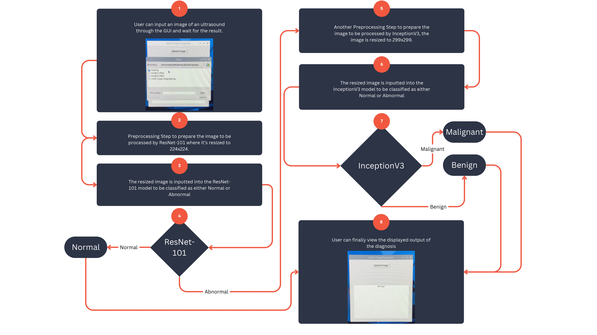

# Breast Cancer Diagnosis

**Bachelor Project**: Developed an embedded system for real-time ultrasound-based breast cancer diagnosis using advanced signal processing and machine learning.

📌 **Grade:** A+  
📄 **DOI:** [10.13140/RG.2.2.28574.24644](https://doi.org/10.13140/RG.2.2.28574.24644)

